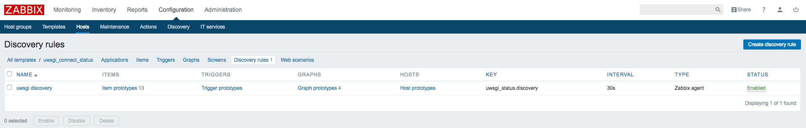
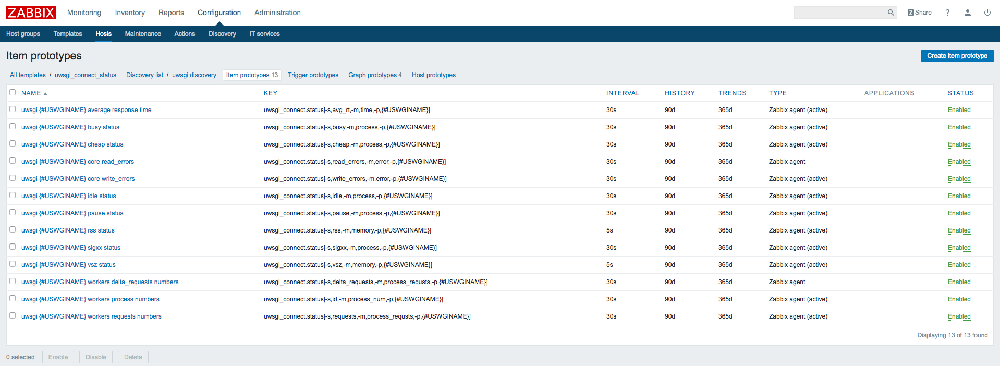
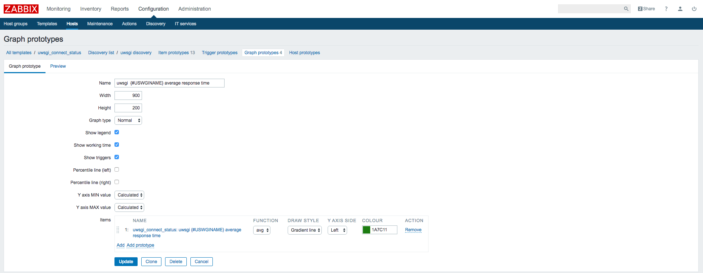
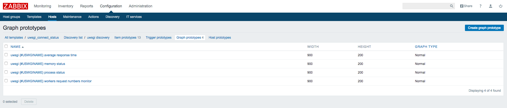
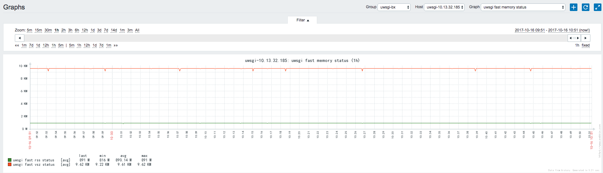
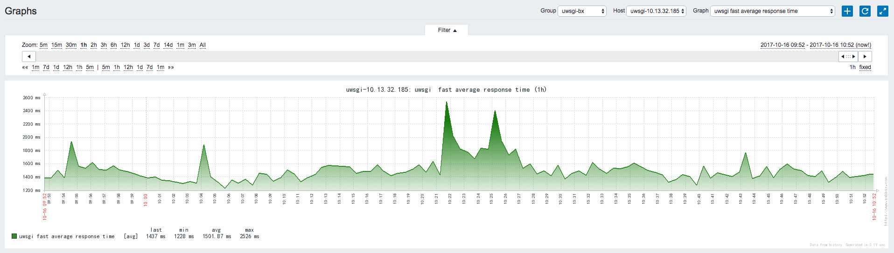

# zabbix_sina

#### 基本配置

----

##### 1.写监控脚本

```
# ls scripts
disk_io_status.py uwsgi_status_mon.py impstats.py
```
##### 2.在配置文件中添加监控项

```
######自定义监控项######################################################################
UserParameter=Queue.full,/etc/dAppCluster/zabbix_scripts/impstats.py -m core.queue -f full
UserParameter=Queue.discarded_full,/etc/dAppCluster/zabbix_scripts/impstats.py -m core.queue -f discarded.full
UserParameter=Queue.discarded_nf,/etc/dAppCluster/zabbix_scripts/impstats.py -m core.queue -f discarded.nf
UserParameter=action.failed,/etc/dAppCluster/zabbix_scripts/impstats.py -m core.action -f failed
UserParameter=action.suspended,/etc/dAppCluster/zabbix_scripts/impstats.py -m core.action -f suspended
UserParameter=action.suspended.duration,/etc/dAppCluster/zabbix_scripts/impstats.py -m core.action -f suspended.duration
UserParameter=action.resumed,/etc/dAppCluster/zabbix_scripts/impstats.py -m core.action -f resumed
UserParameter=imuxsock.ratelimit.discarded,/etc/dAppCluster/zabbix_scripts/impstats.py -m imuxsock -f ratelimit.discarded
UserParameter=omfile.missed,/etc/dAppCluster/zabbix_scripts/impstats.py -m omfile -f missed
UserParameter=omfile.evicted,/etc/dAppCluster/zabbix_scripts/impstats.py -m omfile -f evicted
UserParameter=omfile.closetimeouts,/etc/dAppCluster/zabbix_scripts/impstats.py -m omfile -f closetimeouts
#####service discovery##################################################################
UserParameter=disk_io.discovery,/etc/dAppCluster/zabbix_scripts/disk_io_devices.py
UserParameter=disk_io.status[*],/etc/dAppCluster/zabbix_scripts/disk_io_devices.py $1 $2
UserParameter=uwsgi_status.discovery,/etc/dAppCluster/zabbix_scripts/uwsgi_status_mon.py
UserParameter=uwsgi_connect.status[*],/etc/dAppCluster/zabbix_scripts/uwsgi_status_mon.py $1 $2 $3 $4 $5 $6
```

##### 3.配置完成后重启agent端服务

```
/etc/init.d/zabbix_agentd restart
```

##### 4.在服务端进行测试是否成功

```
# zabbix_get -s 10.13.32.183 -p 10050 -k uwsgi_status.discovery
{
       "data":[
              {
                     "{#USWGINAME}":"slow"
              },
              {
                     "{#USWGINAME}":"fast"
              },
              {
                     "{#USWGINAME}":"other"
              },
              {
                     "{#USWGINAME}":"page"
              }
       ]
}

# zabbix_get -s 10.13.32.185 -p 10050 -k uwsgi_connect.status[-s,rss,-m,memory,-p,fast]
891
```

##### 5.在zabbix前端添加图形监控

- 定义自动发现


- item设置


- Graph设置




已经添加完成。

##### 6.查看最终效果



